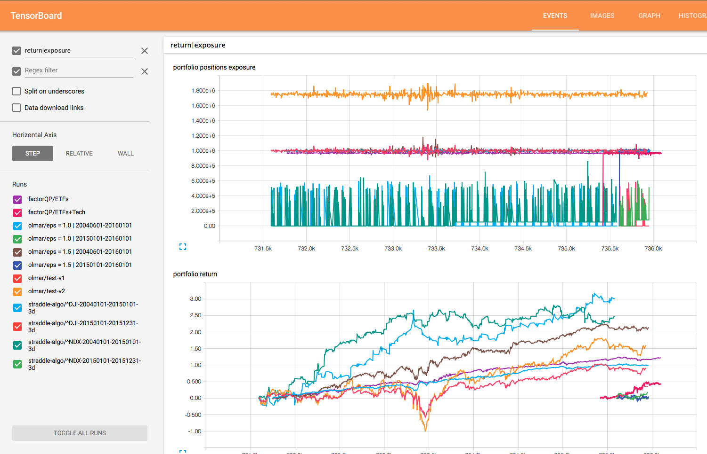
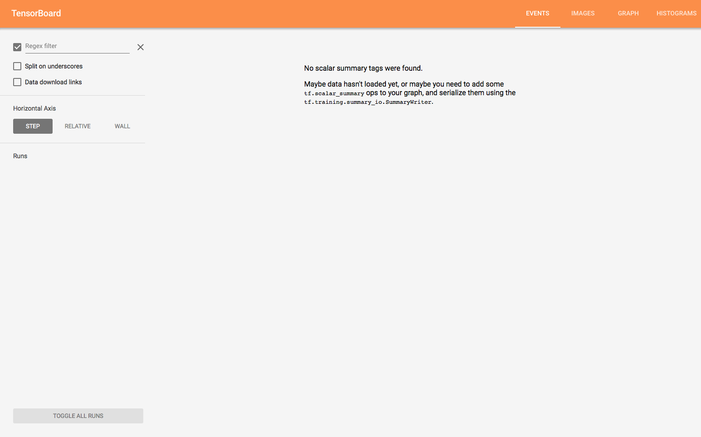
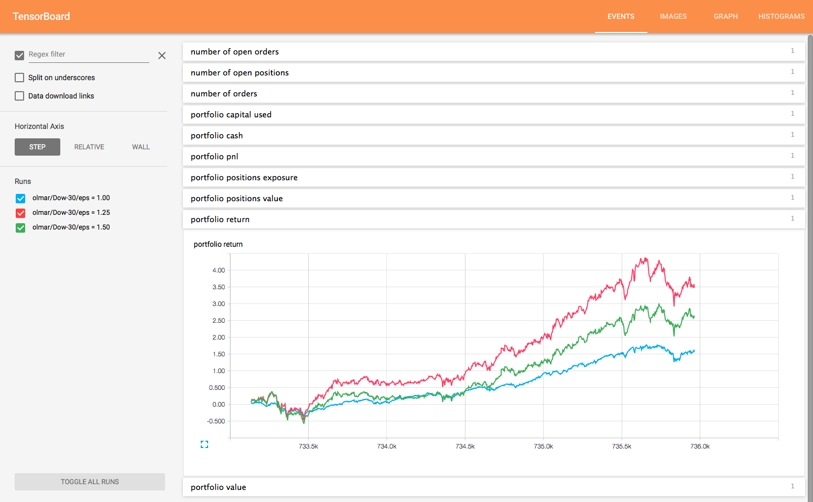
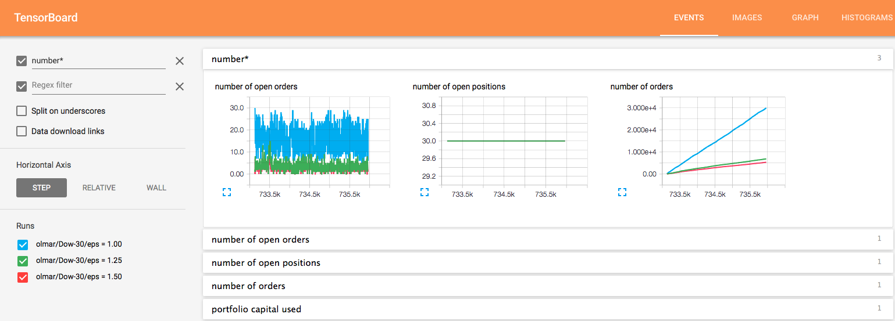
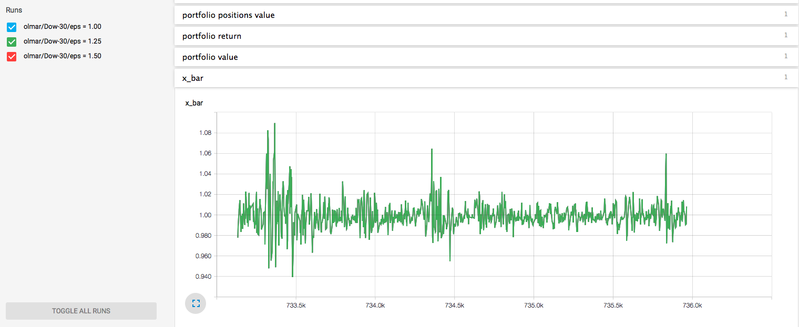

# TensorBoard as a Zipline dashboard

[Zipline](https://github.com/quantopian/zipline) is a Pythonic algorithmic trading library for backtesting and trading quantitative strategies. [TensorBoard](https://github.com/tensorflow/tensorflow/tree/master/tensorflow/tensorboard) is a visualization tool provided with the deep learning library [TensorFlow](https://www.tensorflow.org). These two can be used together to create a dashboard that monitors and compares Zipline backtests. You don't even need to know/care a thing about deep learning.



## TensorBoard Setup

If you have a working installation of Zipline, then the only thing you need to do is install TensorFlow. This can be done [with `pip`](https://www.tensorflow.org/versions/r0.8/get_started/os_setup.html#pip-installation) or better yet `conda`. If you just want to use TensorBoard, go with the `CPU only` option. Once TensorFlow is installed, you can start TensorBoard from the shell with:

```bash
tensorboard --logdir=/tmp/
```

where the `--logdir` argument is the parent directory to where the data for all of your backtest runs will be saved. Go to [http://localhost:6006](http://localhost:6006) and you should see this:



## Using TensorBoard with Zipline

To start logging some info, run the Zipline example `olmar_tensorboard.py` to generate some backtests to monitor:

```bash
python olmar_tensorboard.py
```

This runs three parameterizations of the [OnLine Moving Average Reversion (OLMAR) example backtest](https://github.com/quantopian/zipline/blob/master/zipline/examples/olmar.py) on the Dow 30 from 2004 to 2016. Each one has takes a while to run, but as they run you can see the basic live stats displayed in TensorBoard, including any variables recorded with `algo.record`. You may have to hit refresh on occasion, but there's a setting in `tensorboard.py` to control how often data is written to the log files:

```
flush_secs: How often, in seconds, to flush the added summaries 
            and events to disk. [default 120]
```

### Comparing backtests

Here's a comparison of the returns of each backtest once all have finished:



The regex filters let you group different stats together, so to see stats with "number" in the name:



You can see right away the lower values of epsilon result in lots more trading. Pretty useful for getting some quick insight.

### Recorded variables

Any variable recorded with `zipline.algorithm.TradingAlgorithm.record` is also logged to TensorBoard. We've done that here with the `x_bar` variable in OLMAR:



## Logging process

To use the TensorBoard logging class with a Zipline algo, all you need to do is initialize an instance of the TensorBoard class in the `algo.initialize` method, and add the line `algo.tensorboard.log_algo(algo)` to the end of your `algo.handle_data` function.

One could go wild adding different metrics to be logged, this was just a quick stab at it using attributes from `algo.portfolio` and `algo.blotter`. It's as simple as passing an extra `other_logs` dictionary argument:

 ```python
 algo.tensorboard.log_algo(algo, 
     other_logs={'number_of_short_positions': 5})
 ```

For now these are logged by default:

```python
# add portfolio related things
logs['portfolio value'] = algo.portfolio.portfolio_value
logs['portfolio pnl'] = algo.portfolio.pnl
logs['portfolio return'] = algo.portfolio.returns
logs['portfolio cash'] = algo.portfolio.cash
logs['portfolio capital used'] = algo.portfolio.capital_used
logs['portfolio positions exposure'] = algo.portfolio.positions_exposure
logs['portfolio positions value'] = algo.portfolio.positions_value
logs['number of orders'] = len(algo.blotter.orders)
logs['number of open orders'] = len(algo.blotter.open_orders)
logs['number of open positions'] = len(algo.portfolio.positions)

# add recorded variables from `zipline.algorithm.record` method
for name, value in algo.recorded_vars.items():
    logs[name] = value
```

### x-axis

TensorBoard expects the x-axis to be an integer epoch number, so we use the algorithm date converted to an ordinal:

```python
epoch = datetime.date.toordinal(algo.get_datetime())
```

This is why the x-axis looks weird, but it allows backtests run between different time periods to line up correctly on the charts.

You can see this working here:


